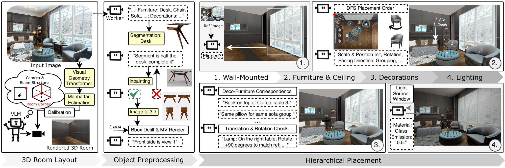
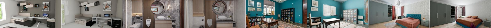

# HARMONY

### Hierarchical Agentic Reasoning for MONocular Image-to-Scene Synthesis

Reconstruct and render a complete, editable 3D room from a single reference
photo — room shell, furniture, wall-mounted objects and decorations as separate
meshes — using VGGT depth/camera estimation, VLM scene reasoning, image-edit
inpainting and Hunyuan3D object generation.

<p align="center">
  <a href="https://arxiv.org/abs/2609.26793">
    </a>
  <a href="https://cwchenwang.github.io/harmony/">
    </a>
  <a href="https://cwchenwang.github.io/harmony/static/videos/overview_intro.mp4">
    </a>
  <a href="https://huggingface.co/datasets/ShufanSun/harmony">
    </a>
  <a href="LICENSE">
    </a>
</p>

The HARMONY300 benchmark's scoring code ships here in [`evaluation/`](evaluation/) — see [Evaluation](#evaluation).


<p align="center"></p>

<p align="center"><em>VGGT depth/camera + Manhattan estimation recover the room shell; each object is segmented, completed by inpainting and lifted to 3D; placement then proceeds hierarchically — <strong>1.</strong>&nbsp;wall-mounted &rarr; <strong>2.</strong>&nbsp;furniture &amp; ceiling &rarr; <strong>3.</strong>&nbsp;decorations &rarr; <strong>4.</strong>&nbsp;lighting — producing the final <code>scene_full.glb</code>.</em></p>

---

## Installation

### 1. Clone and fetch the vendored repos

Three upstream repos are expected as sibling directories. Each has a
`PLACE_MODEL_HERE.md` telling you what to clone and which checkpoints to fetch:

```bash
git clone <this-repo> harmony && cd harmony
# then, per the instructions in each placeholder directory:
#   vggt/                      — depth & camera estimation (imported off sys.path)
#   Grounded-Segment-Anything/ — grounding (imported off sys.path)
#   Hunyuan3D-2/               — 3D-generation server
```

### 2. Conda environments

| Environment | Used for |
|---|---|
| `scenegen` | Main pipeline — `main.py` and every stage module |
| `vllm-env` | Both servers: Qwen3-VL (8080) and Qwen image-edit (8000) |
| `hunyuan3d` | Hunyuan3D server (8081) — needed for the object-generation stages |
| `eagle-embodied` | LocateAnything grounding (segmentation stage 1) |
| `lang-sam` | SAM2 masks (segmentation stage 2) |

Activate `scenegen` only when running `main.py` — the segmentation stages
self-activate `eagle-embodied` / `lang-sam` via subprocess, and the servers run
in `vllm-env` / `hunyuan3d` in their own terminals.

Only `vllm-env` has an exported spec (`environment_yml/vllm-env.yml`);
`requirements.txt` lists the pip packages `scenegen` needs (Python 3.10;
install the CUDA torch/torchvision wheels matching your driver first).
`eagle-embodied`, `lang-sam` and `hunyuan3d` have no exported spec — see
MODELS_AND_PATHS.md for the rest and for the first-run checklist.

---

### 3. Models & checkpoints

**[MODELS_AND_PATHS.md](MODELS_AND_PATHS.md)** lists every vendored model,
conda env and path placeholder this copy of the repo expects you to fill in,
and ends with a first-run checklist. Work through it before your first run.

### 4. Configuration

Copy `.env.example` to `.env` and fill in whichever keys your chosen backends
need (next section). Nothing sources `.env` automatically — export it yourself
in each shell that runs the pipeline or a server:

```bash
set -a; source .env; set +a
```

---

## Backends — pick local or hosted

Three roles are pluggable: the **VLM**, the **image-edit** model and the
**3D generator**. Each can run locally on your own GPU or against a hosted API,
and they are chosen independently — the request/response shapes are identical,
so no code changes are needed either way.

| Role | Local | Hosted | Selected by |
|---|---|---|---|
| VLM (scene reasoning, verification) | Qwen3-VL on :8080 | any OpenAI-compatible API | `SCENEWEAVE_VLM_BACKEND=qwen` \| `gpt` |
| Image edit (inpainting) | QwenImageEdit on :8000 | Gemini image API | `SCENEWEAVE_IMG_EDIT=qwen` \| `gemini` |
| 3D generation | Hunyuan3D on :8081 | — | `HUNYUAN_SERVER` |

### VLM — local Qwen, or a GPT API

You need **one** of these two, not both.

**Option A — local Qwen server** (no API key, no per-call cost, needs a GPU):

```bash
conda activate vllm-env
CUDA_VISIBLE_DEVICES=1 vllm serve \
  Qwen/Qwen3-VL-30B-A3B-Instruct-FP8 \
  --port 8080 \
  --max-model-len 40000 \
  --enforce-eager \
  --served-model-name qwen3 \
  --generation-config vllm \
  --enable-auto-tool-choice \
  --tool-call-parser hermes \
  --gpu-memory-utilization 0.9
```

```bash
export SCENEWEAVE_VLM_BACKEND=qwen      # the default
export VLM_API_URL=http://localhost:8080/v1/chat/completions   # if not on :8080
```

**Option B — a hosted GPT API** (no GPU needed for this role):

```bash
export SCENEWEAVE_VLM_BACKEND=gpt
export OPENAI_API_KEY=sk-...
export SCENEWEAVE_VLM_MODEL=gpt-5.5                            # optional
export SCENEWEAVE_VLM_URL=https://api.openai.com/v1/chat/completions   # optional
```

Any OpenAI-compatible `chat/completions` endpoint works — set
`SCENEWEAVE_VLM_URL` and `SCENEWEAVE_VLM_MODEL` to point elsewhere. If the key
is missing the pipeline says so and falls back to the local Qwen endpoint
rather than failing mid-run.

> Reasoning models (gpt-5.x, o-series) are detected by model id: they reject an
> explicit `temperature`/`top_p`, and their `max_tokens` budget covers hidden
> reasoning as well as the answer, so both are adjusted automatically.

### Image edit — local Qwen, or Gemini

```bash
conda activate vllm-env
CUDA_VISIBLE_DEVICES=2 python -m uvicorn Qwen.img_server:app --host 0.0.0.0 --port 8000
```

or `export SCENEWEAVE_IMG_EDIT=gemini` with `GEMINI_API_KEY`.

### 3D generation — Hunyuan3D

Hunyuan3D is the only backend for all four object-generation stages. On a
Hunyuan3D 404 — the known can't-mesh-this signature, typically a glass or
transparent object deadlocking marching cubes — the pipeline re-inpaints that
one object as an opaque material and retries once before giving up on it.

Windows, doors and framed art are never 3D-generated: they become flat textured
plane meshes via `object_placement/wall_mounted/generate_window_plane.py`.

---

```bash
conda activate hunyuan3d
cd Hunyuan3D-2
python api_server.py --host 0.0.0.0 --port 8081 --enable_tex
```

Needed only for the four object-generation stages; you can skip those while
iterating (see `--skip` below) and the rest of the pipeline still runs.

### Full environment variable reference

Copy `.env.example` for the complete list.

| Variable | Default | Purpose |
|---|---|---|
| `SCENEWEAVE_VLM_BACKEND` | `qwen` | `qwen` → local :8080; `gpt` → hosted OpenAI-compatible API |
| `OPENAI_API_KEY` | — | Key for the `gpt` backend (`NVIDIA_API_KEY` / `SCENEWEAVE_GPT55_KEY` also accepted) |
| `SCENEWEAVE_VLM_MODEL` | `gpt-5.5` | Model id for the `gpt` backend |
| `SCENEWEAVE_VLM_URL` | api.openai.com | Endpoint for the `gpt` backend |
| `VLM_API_URL` | `http://localhost:8080/v1/chat/completions` | Local Qwen chat endpoint |
| `SCENEWEAVE_IMG_EDIT` | `qwen` | `qwen` → local :8000; `gemini` → Google image API |
| `GEMINI_API_KEY` | — | Google `AIza…` key for the Gemini endpoint |
| `SCENEWEAVE_GEMINI_MODEL` | `gemini-2.5-flash-image` | Gemini image-edit model id |
| `SCENEWEAVE_QWEN_IMG_EDIT_URL` | `http://localhost:8000/generate` | Local image-edit endpoint |
| `HUNYUAN_SERVER` | `http://localhost:8081` | Hunyuan3D server address |

> Run each local server in its own terminal / tmux pane. `main.py` runs in the
> **`scenegen`** env and reaches the servers over HTTP on localhost.

---

## Quick start

```bash
conda activate scenegen

# --image is required; output defaults to outputs/<timestamp>/
python main.py --image data/indoor_images/my_room.jpg

# Explicit output directory
python main.py --image data/indoor_images/my_room.jpg --output outputs/my_room

# Resume an existing run (each stage skips work already on disk)
python main.py --image data/indoor_images/my_room.jpg --rerun-dir outputs/my_room

# Skip the slow 3D-generation stages while iterating
python main.py --image data/indoor_images/my_room.jpg \
    --skip object_generation furniture_object_generation \
           decoration_object_generation ceiling_object_generation

# Run only specific stages
python main.py --image data/indoor_images/my_room.jpg \
    --stages floorplan segment_wall_objects inpaint_wall_objects
```

### CLI flags

| Flag | Default | Purpose |
|---|---|---|
| `--image PATH` | **required** | Reference indoor photo |
| `--output DIR` | `outputs/<timestamp>/` | Output directory |
| `--rerun-dir DIR` | — | Resume from an existing output directory (mutually exclusive with `--output`) |
| `--stages STAGE …` | all | Run only the listed stages (`python main.py --help` prints every stage name) |
| `--skip STAGE …` | none | Run every stage except those listed |
| `--no-vlm` | off | Disable VLM post-checks in the placement stages |
| `--base-render PATH` | — | Override the background canvas used for compositing |
| `--gemini-model NAME` | `gemini-2.5-flash-image` | Image model for empty-room generation |
| `--animate` | off | Save `furniture/placement_animation.gif` of every optimization step |
| `--animate-width N` | `960` | Width of that GIF |
| `--animate-frame-ms N` | `1000` | Per-frame duration in ms |
| `--locate-anything` | — | Deprecated no-op; LocateAnything→SAM2 is the only segmentation backend |

On start, `main.py` copies the reference photo into the output directory, so
`--rerun-dir` is self-contained afterwards. A stage that raises is logged with
a traceback and the pipeline continues to the next one.

---

## Project structure

```
harmony-release/
├── main.py                       — pipeline entry point, stage registry
├── MODELS_AND_PATHS.md           — what you must supply before first run
├── .env.example                  — every environment variable, documented
├── floorplan/                    — photo → room shell
│   ├── pipeline.py                 stage-1 driver
│   ├── agent/                      VLM scene parsing & prompt construction
│   ├── vggt_estimates/             VGGT depth, Manhattan frame, camera alignment
│   ├── wall_line/                  wall mesh, camera placement, rasteriser
│   ├── openings/                   door & window detection
│   ├── geometry_refine.py          depth-guided wall-extent refinement
│   ├── gen_empty_room_ref.py       furniture removal → empty_room_ref.png
│   └── texture_from_reference.py   backproject real textures onto the shell
├── object_placement/
│   ├── segmentation_la_sam2.py     LocateAnything→SAM2 driver (all 3 domains)
│   ├── vlm_backend.py              qwen / gpt55 VLM router
│   ├── wall_mounted/               windows, doors, art, mirrors, sconces
│   ├── furniture/                  sofas, beds, tables, chairs, rugs
│   ├── decorations/                pillows, books, plants, vases
│   ├── ceiling/                    pendants, chandeliers, fans
│   ├── missing_items/              GroundingDINO pass for unplaced items
│   └── assemble_scene_glb.py       merge shell + all objects → scene_full.glb
├── lighting_module/               — VLM light estimation, pyrender & Cycles renders
├── Qwen/                          — image-edit server + backend adapter
├── evaluation/                    — CLIP / photometric / GPT-judge harness
├── scripts/                       — batch runner + standalone debug runners
├── data/                          — input photos (see PLACE_DATA_HERE.md)
├── outputs/                       — per-run output directories
├── environment_yml/               — conda environment specs
├── vggt/                          — VGGT (vendored, required)
├── Grounded-Segment-Anything/     — GroundingDINO + SAM (vendored, required)
└── Hunyuan3D-2/                   — Hunyuan3D (vendored, required)
```

Each object domain follows the same module layout: `segment_*` (or the shared
LocateAnything driver) → `inpaint_*` → `object_generation_*` →
`material_properties` → `place_*`. The furniture package holds the shared
implementations that the other domains import: `material_properties.py`
(`estimate_material` / `apply_to_glb`) and the Hunyuan3D client in
`object_generation.py`.

---

## Results

<p align="center"></p>

<p align="center"><em>Reconstructions across HARMONY300 — each rendered from its own recovered camera. More on the <a href="https://cwchenwang.github.io/harmony/">project page</a>.</em></p>

---

## Evaluation

`evaluation/` is the scoring code for the **HARMONY300** benchmark — the same
harness that produces the numbers on the HARMONY300 leaderboard
(linked from the [project page](https://cwchenwang.github.io/harmony/)). Get the 300
scenes, their reference photos and per-scene cameras from the
[dataset on Hugging Face](https://huggingface.co/datasets/ShufanSun/harmony).

It reports two families of metrics:

| Metric | Script | Scenes |
|---|---|---|
| N-CLIP, PL, LPIPS — rendered from each scene's own camera vs. the reference photo | `eval_runner.py` | all 300 |
| Chamfer distance, F@0.1 / F@0.01 / F@0.001 vs. ground-truth meshes | `chamfer_eval.py` | the 100 Front3D scenes that have GT |

Appearance scoring is independent of the pipeline and driven by environment
variables:

```bash
export REF_DIR=/path/to/harmony300/ref
export REGEN_DIR=/path/to/3D-RE-GEN/results
export GEN3DSR_DIR=/path/to/Gen3DSR/out
export HARMONY_ROOTS=/path/to/harmony/outputs
bash evaluation/evaluation.sh
```

Geometry scoring takes the method roots explicitly, since each baseline stores
its meshes differently:

```bash
python evaluation/chamfer_eval.py \
    --gt-root   /path/to/front3d_gt/sceneobjgt \
    --harmony-root /path/to/outputs/harmony300 \
    --out       results_geometry.json
```

Each `--<method>-root` is optional; a method with no root given is skipped. The
scene list is taken from `--gt-root`, so the same scenes are scored for every
method. Alignment is Sim(3)-normalised + ICP, because the methods do not share
the ground truth's world frame.

See [evaluation/README.md](evaluation/README.md) for the per-method directory
layouts expected by `loaders.py`.

---

## License

This repository is released under the [MIT License](LICENSE).

The vendored upstream repos (VGGT, Grounded-Segment-Anything, Hunyuan3D-2) and
the model weights they fetch keep their own licenses — check each before any
commercial use. HARMONY300's easy tier derives from 3D-FRONT, which is licensed
for **non-commercial research only**; per-scene provenance is recorded in the
dataset's `attribution.csv`.

---

## Citation

```bibtex
@article{sun2026harmony,
  title   = {HARMONY: Hierarchical Agentic Reasoning for Monocular Image-to-Scene Synthesis},
  author  = {Sun, Shufan and Wang, Chen and Gu, Jiatao and Liu, Lingjie},
  journal = {arXiv preprint arXiv:2609.26793},
  url     = {https://arxiv.org/abs/2609.26793},
  year    = {2026}
}
```
